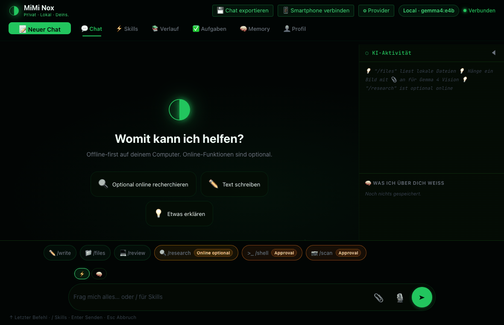
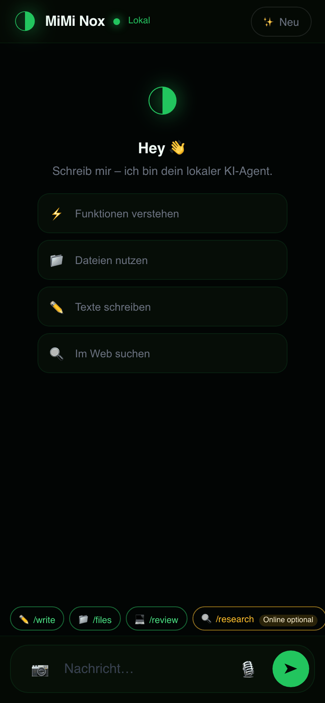

<div align="center">


# MiMi Nox

**Offline-first local AI assistant for chat, images, files, memory, and approval-gated tools. Optional online/API features are always opt-in.**

MiMi Nox installs the app in one command — the AI engine is chosen in the app afterwards (local Ollama, remote Ollama, or any OpenAI-compatible endpoint like a DGX Spark). The installer does not install Ollama and does not pull any model. Custom Ollama servers, public mobile access, web research, text-to-speech services, and OpenAI-compatible APIs are optional opt-in paths.

[](https://python.org)
[](https://ollama.com)
[](LICENSE)
[](https://github.com/bemlerlabs/mimi-nox/actions/workflows/tests.yml)
[](https://github.com/bemlerlabs/mimi-nox/actions/workflows/frontend-build.yml)

</div>

## ⚡ Quick Start

```bash
curl -fsSL https://raw.githubusercontent.com/bemlerlabs/mimi-nox/main/install.sh | bash
```

<details>
<summary>What this command does</summary>

The installer targets `~/Documents/MiMi-Nox`, prepares Python, builds the PWA, checks whether a local Ollama is already available (informational only — never installs or pulls), starts the local server, and opens:

```text
http://127.0.0.1:8765
```

On first run you pick the AI engine in the app: local Ollama (bring your own models), remote Ollama, or an OpenAI-compatible endpoint (e.g. a DGX Spark — no download, no install). Ollama model requirements (RAM-basiert): 12b ≈ 16GB, e4b ≈ 8–10GB, e2b ≈ 4–6GB unified memory; 256K context.

**Supply-Chain-Integrität:** Alle Vendor-Downloads (uv) werden vor der Ausführung gegen gepinnte SHA256-Hashes verifiziert — Abweichung bricht den Installer fest ab (kein blindes `curl | sh`). Rotation via `MIMI_NOX_UV_INSTALL_SHA256`.

</details>

## Demo Videos

| Desktop PWA | Phone via QR |
|---|---|
|  |  |
| Chat, skills, provider settings, and mobile pairing | Scan QR, open mobile PWA, chat from the same LAN |

The demos show the local PWA flow: chat, skill input, provider settings, LAN mobile pairing, and the mobile PWA after QR pairing. Demo responses are generated by local fixtures for repeatable documentation capture; normal runtime uses your configured local Ollama provider.

## Phone Via QR

MiMi Nox is designed to move from desktop to phone without an app store install:

1. Start MiMi Nox on your computer.
2. Open the desktop PWA.
3. Click **Connect Phone**.
4. Scan the QR code with a phone on the same local network.
5. Chat from the mobile PWA while MiMi Nox keeps running on your computer.

The QR flow is **LAN-first**. Public access is an optional online mode and must be selected explicitly.

## What It Is

MiMi Nox is a local web app and Python backend for a personal AI assistant:

| Capability | Default behavior | Network behavior |
|---|---|---|
| Chat with the chosen model | Local Ollama (in-app selection) | No internet required once model is installed |
| Image understanding / OCR | Local Ollama (in-app selection) | No internet required once model is installed |
| Files, PDFs, profile, memory | Local disk | No internet required |
| QR phone access | Local network | Public mobile tunnel is Optional Online |
| Shell and desktop actions | Approval required | Local only unless a tool explicitly uses the internet |
| `/research` | Disabled until confirmed | Optional Online Web search |
| TTS service integrations | Optional | Internet, provider-dependent |
| Custom Ollama server | Advanced Opt-in | Localhost or LAN endpoint |
| OpenAI-compatible API | Advanced Opt-in | Your configured API provider |

Offline-first means the core product works locally once you have picked an engine in the app (Ollama or OpenAI-compatible). It does not mean every optional integration is offline.

## Why Use It

- **Local by default:** no account is required for the default local path.
- **Clear online boundaries:** web research, public phone access, API providers, and external TTS are labeled as opt-in.
- **Useful beyond chat:** images, files, PDFs, memory, tasks, skills, and browser/tool workflows are exposed in one PWA.
- **Phone access without an app store:** scan a QR code to use the mobile PWA on the same network.
- **Repairable setup:** `miminox doctor` explains missing Ollama/model states and prints concrete recovery commands.

## Install Options

### Existing Checkout

```bash
./install.sh
```

### Windows PowerShell (One-Liner)

```powershell
curl -fsSL https://raw.githubusercontent.com/bemlerlabs/mimi-nox/main/install.ps1 -o install.ps1; powershell -ExecutionPolicy Bypass -File .\install.ps1
```

Oder direkt aus der lokalen Datei:

```powershell
powershell -ExecutionPolicy Bypass -File .\install.ps1
```

### CLI

Drei Entry-Points, eine Codebasis:

```bash
miminox --version                 # mimi-nox 4.0.0
miminox --help                    # alle Subcommands, Beispiele, Exit-Codes
miminox start --open              # lokale Web-App starten + Browser öffnen (Port 8765)
miminox start --lan               # LAN-Binding für QR-Mobile-Pairing
miminox start --model gemma4:12b  # Modell explizit wählen
miminox doctor                    # Setup-Check (Ollama, Modell, Server)
miminox doctor --fix              # sichere lokale Reparaturen (Repo, Deps, Ollama, Modell)
miminox doctor --json             # maschinenlesbarer Health-Bericht
miminox update                    # Repo pull + Dependencies + Modell
miminox tui                       # Terminal-UI (Textual) — Standard-Engine
miminox tui --model gemma4:12b    # TUI mit explizitem Ollama-Modell
miminox tui --configure           # END-USER wählt Provider (Onboarding)
miminox serve                     # OpenAI-kompatible Engine (/v1/chat/completions)
miminox tool <name> --dry-run     # Tool deterministisch ausführen (Approval-Gate)
```

**Standard-Engine (Sprint 1, User-Mandat):** `miminox tui` startet ohne Flag mit der Mimi Tech AI Standard-Engine (Qwen 3.8 27B auf DGX Spark, OpenAI-kompatibel). Kein Ollama-Pull, kein Download — die Engine läuft remote auf dem DGX Spark und ist sofort startklar. Die persistierte Wahl liegt unter `~/.mimi-nox/engine.json`.

**Provider-Onboarding:** `miminox tui --configure` startet die Engine-Auswahl für END-USERs (lokale Ollama / eigener OpenAI-kompatibler Endpoint / OpenRouter). Die Wahl wird unter `~/.mimi-nox/engine.json` gespeichert und bei jedem Start wiederverwendet; explizite `--model`/`--api-url`-Flags gewinnen immer. API-Keys werden nie gespeichert.

**Approval-Gates (Sprint 1, Threat-Model E1):** `miminox tool <name>` führt ein einzelnes Tool deterministisch aus (ohne LLM-Loop) mit konservativen Approval-Defaults:

- `SAFE` Tools (read-only) → immer erlaubt
- `MUTATING` / `NETWORK` Tools → erfordern explizite Freigabe
- `--dry-run` → Vorschau ohne Ausführung (Datei bleibt unangetastet)
- `--yes` → explizite Freigabe
- `--no` → explizite Ablehnung (Tool wird nicht ausgeführt)
- `--json` → maschinenlesbares JSON-Output

Exit-Codes: `0` Erfolg/Ausführung · `1` Laufzeit/Reparatur-Fehler · `2` Usage-Fehler · `3` durch Policy blockiert.

Installations-Modus wählbar: `--cli` (nur TUI/Textual, minimale Dependencies) oder `--desktop`/`--gui` (Standard, PWA + gui/voice). Ohne Flag fragt der Installer interaktiv.

### Docker

```bash
docker compose up
```

Docker is available for development and advanced users. The primary first-run path is the one-command installer above.

## System Requirements

| Component | Minimum | Recommended |
|---|---|---|
| OS | macOS 13+, Ubuntu 22+, Windows with PowerShell path | macOS 14+ or recent Linux |
| Python | 3.10 | 3.12+ |
| Ollama | User-managed (installer only detects) | Latest stable |
| RAM | 8 GB (`gemma4:e4b`) | 16 GB+ (`gemma4:12b`) — or use a remote endpoint |
| Storage | 12 GB free | 20 GB+ |

## Feature Status

| Feature | Status | Notes |
|---|---|---|
| Desktop PWA chat | Active | Root PWA is the main product |
| Tauri desktop shell | Active | Tray, Window-Controls, Updater, Command-Palette (Cmd+K) |
| Mobile PWA via QR | Active | LAN by default; public mode requires explicit opt-in |
| Telegram channel (gateway) | Alpha (Sprint 3) | On-device gateway adapter, outbound-only transport, allowlist pairing, same ApprovalPolicy; e2e vs. local harness required pre-ship |
| Provider settings | Active | `local_ollama`, `custom_ollama`, `openai_compatible` |
| Hardware-adaptive model | Active | RAM-based `gemma4:12b` / `e4b` / `e2b`; override via `MIMI_NOX_MODEL`, `--model`, or UI |
| Missing model recovery | Active | UI and CLI show `miminox doctor` / `miminox start` guidance |
| Vision upload | Active | Sends images to the configured Ollama-compatible vision path |
| File/PDF workflows | Active | Local file access is restricted by tool policy |
| Shell/desktop actions | Active | Approval-gated |
| v2 experiments | Experimental | Not the main product surface |

## Skills

Built-in shortcuts are visible in the composer on desktop and mobile:

| Skill | Behavior |
|---|---|
| `/write` | Draft emails, notes, summaries, and structured text |
| `/review` | Review code, plans, or documents |
| `/files` | Work with local files through approved tools |
| `/pdf` | Analyze and create PDF-oriented content |
| `/scan` | Analyze screenshots or images; approval is required for risky actions |
| `/svg` | Draft SVG assets |
| `/chart` | Create chart-ready output |
| `/shell` | Prepare shell commands; execution requires approval |
| `/research` | Optional online research; confirmation required before sending |

## Mobile Pairing

1. Start MiMi Nox on the Mac or PC.
2. Open the desktop PWA.
3. Click **Connect Phone**.
4. Scan the QR code from a phone on the same local network.

If the phone cannot reach the computer, start with LAN binding:

```bash
miminox start --lan
```

The default QR code points to a LAN URL. Public access is available only through an explicit online option and should be used only when you understand the exposure.

## Telegram Channel — Gateway-Alpha (Sprint 3)

**Your AI gateway on your own devices. No cloud. No account. One command.**

MiMi Nox turns your own machine into an AI gateway. Chat from your phone via
Telegram — and the gateway itself stays on your device. What "no cloud"
means, precisely:

- **The gateway is on-device, not a relay.** MiMi Nox runs as one local
  service (one FastAPI app, one runtime). The Telegram channel is an adapter
  inside that service — `core/tg_gateway.py` — routed into the same
  engine and chat pipeline as the desktop PWA (`core/engine_config.py` +
  `core/tools/registry.execute_tool`). The channel adds no second runtime
  and no relay process, and no MiMi Nox server stores or proxies your
  conversations. (The repo's documented, opt-in `miminox serve` OpenAI
  adapter is a separate, user-invoked surface — not part of the gateway.)
  The channel adapter is verified end-to-end against the local model
  harness before it ships (Sprint 3 DoD).
- **Telegram is the channel transport, not a pipeline.** Messages travel
  over the Telegram API as an outbound connection from your device (MiMi Nox
  opens no inbound port and operates no relay of its own) — the same category
  as sending an email: the carrier's network is used, our cloud is not.
  Conversation content, tool approvals, local files, and model execution
  never pass through a MiMi Nox or third-party cloud.
- **Approval-gated, same as the local product.** Channel sessions reuse the
  P0-1 ApprovalPolicy (`core/tools/approval.py`): mutating and network tools
  are denied by default and require your explicit approval. No auto-approve.
- **No account, pairing by allowlist.** You pair your Telegram user ID into
  a static allowlist stored on your own device. The allowlist is empty by
  default, so the gateway answers nobody until you add someone. No MiMi Nox
  account, no sign-up, no telemetry in this repo.
- **One command.** The one-command installer starts the local service;
  enabling the channel is a local configuration step (bot token stored with
  owner-only file permissions, same hardening as `~/.mimi-nox/engine.json` —
  `0700` dir, `0600` file — see `core/engine_config.py`), not a registration
  with us.

**Status: alpha.** The Telegram channel ships as Gateway-Alpha in Sprint 3
and is verified end-to-end against the local model harness before release.
Everything above the channel adapter is the already-shipping offline-first
core.

## Security And Privacy

| Mechanism | What it does |
|---|---|
| Local default bind | The server starts on `127.0.0.1` unless LAN mode is requested |
| Conservative CORS | Browser origins are restricted |
| Tool approval | Shell, screenshot, and GUI actions require explicit approval |
| Local memory path | Personal data is stored under local MiMi Nox paths |
| Optional online labels | Network features are shown as opt-in |
| No telemetry in this repo | No analytics or tracking pipeline is included |

Security reports: see [SECURITY.md](SECURITY.md).

## Development

```bash
python -m venv .venv
source .venv/bin/activate
pip install -e ".[dev]"
```

Run the app locally:

```bash
python run_server.py
```

### Frontend (PWA, `app/`)

The root PWA is the main product. React 19 + Vite 6 + TypeScript + Tailwind:

```bash
cd app
npm ci          # or: npm install
npm run dev     # Vite dev server
npm run build   # tsc -b && vite build (type-check + production build)
npm run preview # Vite preview
```

Frontend unit tests use Vitest (`npm test`) and Playwright specs live in `app/tests/playwright/`.

### Demo videos

```bash
python scripts/create_demo_media.py
```

## Project Structure

```text
app/                React + Vite + TS PWA (main product), Tauri shell in app/src-tauri/
app/tests/playwright/  Playwright specs (frontend, CI-validated)
core/               Python core: chat, tools, vision, memory, skills, scheduler, profile
server/             FastAPI server + routes (chat, memory, mobile, tasks, vision, ...)
ui/                 Textual TUI / text UI
docs/               design docs, mockups, screenshots, demo media
scripts/            dev/demo/eval helpers
skills/             built-in skill markdown (prompts, rubrics, examples)
knowledge/          offline knowledge base (German survival/medical/engineering)
.github/workflows/  CI: tests.yml + frontend-build.yml
install.sh          one-command installer (macOS/Linux)
install.ps1         one-command installer (Windows PowerShell)
```

## Testing

Quality gates run in CI on every push and pull request:

- **Integration checks** (`tests.yml`): package import integrity, installer syntax
  (bash + PowerShell), security-default audit (conservative server binding),
  Docker image build
- **Frontend build** (`frontend-build.yml`): TypeScript type check, Vite production
  build, ESLint

The Python test suite lives outside the public repository (maintainer-only) and is
run locally with `pytest tests/ -q` before release. Contributors validate their
changes with the checks listed in [CONTRIBUTING.md](CONTRIBUTING.md).

## Repository Hygiene

Tracked files should not include generated dependency folders, local databases, WAL/SHM sidecars, secrets, caches, or generated media frames. Final README media files in `docs/media/` are intentionally tracked.

## Architecture

```text
Browser PWA
  -> FastAPI server
    -> Provider router
      -> engine chosen in-app: local Ollama, remote Ollama, or OpenAI-compatible (DGX)
      -> explicit --model/--api-url flags override the persisted choice

Core modules
  -> chat, tools, vision, memory, skills, scheduler, profile
```

## Contributing

1. Fork the repository.
2. Create a feature branch.
3. Add or update Given-When-Then tests.
4. Run the narrowest relevant tests first, then the release checks above.
5. Open a pull request using the template.

See [CONTRIBUTING.md](CONTRIBUTING.md).

## License

Apache License 2.0. See [LICENSE](LICENSE).
