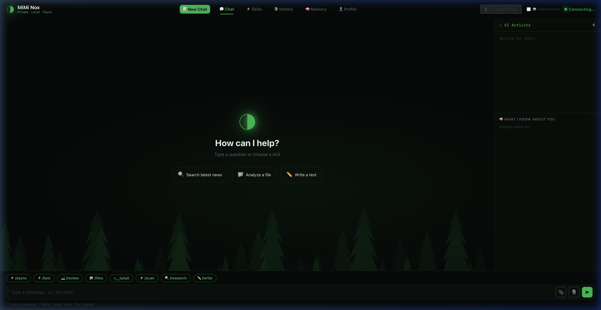
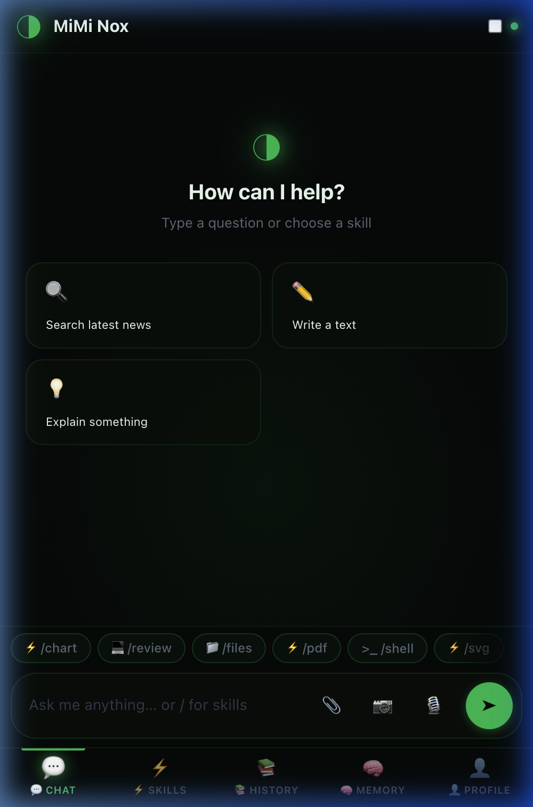

<div align="center">


<br>

# Your AI. Your Knowledge. Your Machine.

**The only AI agent that learns from YOU, works offline, and never sends a single byte to the cloud.**

<br>

[](https://python.org)
[](https://ollama.com)
[](https://ai.google.dev/gemma)
[](LICENSE)
[](https://github.com/MimiTechAi/mimi-nox/actions/workflows/tests.yml)
[](#-docker)
[](#-internationalization)

</div>

<br>

<div align="center">

### 🐳 One command. That's it.

```bash
docker compose up
```

Then open **http://localhost:8765** — your private AI is ready. 🚀

</div>

<br>

<div align="center">

|  | MiMi Nox 🌲 | ChatGPT / Claude | OpenClaw |
|---|---|---|---|
| **Your data stays on YOUR device** | ✅ Always | ❌ Cloud | ⚠️ Partial |
| **Works 100% offline** | ✅ Gemma 4 | ❌ | ❌ |
| **Learns from YOU over time** | ✅ Local knowledge tree | ❌ Feeds their models | ❌ |
| **Phone app without App Store** | ✅ QR → PWA | ❌ | ❌ |
| **You can see the AI thinking** | ✅ Thinking Panel | ❌ Blackbox | ❌ |
| **Cost per month** | **$0** | $20–200 | $20–200 |
| **Works in your language** | ✅ All languages | ✅ | ✅ |

</div>

---

[Quick Start](#-quick-start) · [Why MiMi Nox?](#-why-mimi-nox) · [Screenshots](#-screenshots) · [API Docs](#-api-reference) · [Contributing](#-contributing)

---

## 🎬 See it in action

<div align="center">



*Dark Forest UI — AI Activity Panel, Thinking Mode, Skills, and Long-Term Memory*

</div>

> 🎥 **Full demo video coming soon.** `docker compose up` and see for yourself in 30 seconds.

---

## 🧠 Why MiMi Nox?

### Your Knowledge Stays on YOUR Device

Every time you chat with ChatGPT or Claude, **your conversations feed their models**. Your ideas, your code, your private questions — all stored on servers you don't control.

MiMi Nox is different:

> **MiMi builds YOUR personal knowledge base — on YOUR machine.**
>
> Every conversation, every correction, every preference is stored **locally** in your `~/.mimi-nox/` folder. MiMi learns your writing style, remembers your projects, and gets smarter over time — without sending a single byte to OpenAI, Google, or anyone else.
>
> *You own your AI. You own your knowledge. Delete the folder — it's gone. Forever.*

MiMi Nox is a **fully local, autonomous AI agent** powered by **Gemma 4 (E4B)** via [Ollama](https://ollama.com). It runs as a premium web app with a browser interface, works in **any language**, and scales from your laptop to DGX.

---

## 🔥 What makes MiMi Nox different?

Most local AI tools are just chat wrappers. These three features don't exist anywhere else:

### 🖥 Visual Computer Use — Your AI sees your screen

MiMi can take a screenshot of your desktop, identify UI elements using Gemma 4's vision transformer, calculate pixel coordinates, and click buttons — like a human sitting at your computer.

```
User: "Close the cookie banner on this website"

MiMi:
  1. take_screenshot()        → captures your screen
  2. Gemma4 Vision            → "Cookie banner at (834, 612)"
  3. vision_click(834, 612)   → 🖱️ click
  4. "Done. Banner dismissed."
```

> ⚠️ macOS only. Requires: *System Settings → Privacy → Accessibility + Screen Recording*.

### 📱 QR-Code Mobile Pairing — Your phone, instantly

No app install. No account. No port forwarding.

1. Click **"📱 Connect Phone"** in the desktop UI
2. Scan the QR code with your phone camera
3. → Full WhatsApp-style chat appears, with all tools available, including 📷 camera for vision queries

Works over the internet (automatic SSH tunnel) and installs as a **PWA on iOS & Android**.

### 🐝 Swarm Pipelines — Multiple agents, one command

```
/swarm "Research Tesla Q4 earnings, summarize in German, write a LinkedIn post"
```

MiMi spawns three parallel agents: Researcher → Writer → Social Media Expert. Each works autonomously, results flow back into your chat.

---

## ⚡ Quick Start

### 🐳 Docker (recommended)

```bash
docker compose up
```

Then open: **http://localhost:8765** 🚀

> The first run downloads Gemma4 E4B (~2.5 GB) — after that it starts in seconds.
> Your knowledge, memory, and sessions are stored in Docker volumes on YOUR machine.

<details>
<summary><strong>📦 Manual setup (without Docker)</strong></summary>

**Prerequisites:** Python 3.10+, [Ollama](https://ollama.com) installed

#### One-command setup

```bash
git clone https://github.com/MimiTechAi/mimi-nox.git
cd mimi-nox
./install.sh
```

The script handles everything:
1. ✅ Python version check (≥ 3.10)
2. ✅ Installs Ollama (if missing) or auto-updates if < v0.20.0
3. ✅ Downloads `gemma4:e4b` (~2.5 GB, one-time)
4. ✅ Creates virtual environment + dependencies
5. ✅ Optional instant start

> **Note:** Gemma4 E4B requires Ollama ≥ v0.20.0. The install script detects older versions and updates automatically.

#### Manual setup

```bash
git clone https://github.com/MimiTechAi/mimi-nox.git
cd mimi-nox
python -m venv .venv && source .venv/bin/activate
pip install -e ".[gui]"
ollama pull gemma4:e4b
```

#### Run

```bash
# Web app (recommended)
python run_server.py

# With options
python run_server.py --port 9000     # Different port
python run_server.py --reload         # Dev mode with auto-reload

# TUI (terminal alternative)
mimi-nox
mimi-nox --model llama3.3           # Different model
```

Then open: **http://127.0.0.1:8765** 🚀

**To uninstall:** Delete the `mimi-nox/` folder. That's it. Gone. Zero traces.

</details>

---

## 💻 System Requirements

| | Minimum | Recommended |
|---|---|---|
| **OS** | macOS 13+ / Ubuntu 22+ | macOS 14+ (Apple Silicon) |
| **Python** | 3.10 | 3.12+ |
| **Ollama** | ≥ 0.20.0 | latest |
| **RAM** | 8 GB | 16 GB+ |
| **Storage** | 5 GB | 20 GB+ |
| **GPU** | – | M1/M2/M3 or NVIDIA |

### Platform Compatibility

| Feature | macOS | Linux | Windows |
|---|---|---|---|
| Chat, Skills, Memory, all Tools | ✅ | ✅ | ✅ |
| Headless Browser | ✅ | ✅ | ✅ |
| Vision Click/Type (Desktop GUI) | ✅ | ⚠️ X11 required | ❌ |
| Desktop Screenshot | ✅ | ⚠️ X11 required | ❌ |
| Headless Server (no GUI) | ✅ | ✅ (graceful degradation) | ✅ |
| PWA + QR Pairing | ✅ | ✅ | ✅ |
| TTS (Edge-TTS) | ✅ | ✅ | ✅ |

---

## 📸 Screenshots

<div align="center">

### Desktop Interface


*Black Forest Edition design with AI Activity Panel, Skills, and Long-Term Memory*

<br>

### Mobile Chat (via QR Code)



*WhatsApp-style chat – scan the QR code and start chatting instantly*

</div>

---

## ✨ Features at a glance

### 🤖 AI Core

| Feature | Details |
|---|---|
| **ReAct + Reflection** | Self-correcting answers with built-in quality checks |
| **Tool Calling** | 15 verified tools – Web, Shell, Files, Vision, Browser |
| **Swarm Pipeline** | Multi-agent parallel execution via `/swarm` |
| **Streaming** | Token-by-token output via SSE |
| **Thinking Mode** | Real-time reasoning visualization (Gemma 4 native) |
| **Multimodal Vision** | Upload images (📎 desktop / 📷 mobile) – Gemma4 analyzes natively |

### 🗂 Memory & Context

| Feature | Details |
|---|---|
| **Vector Store** | Semantic long-term memory (ChromaDB) |
| **Session Persistence** | Seamless continuation via atomic-write JSON |
| **User Profile** | Learning persona – name, expertise, language, style |
| **Error Journal** | Collects corrections, prevents repetition |
| **Feedback Loop** | 👍/👎 per answer → improves future quality |

### 🛠 Tools (15 – all verified ✅)

<details>
<summary><strong>Show all 15 tools</strong></summary>

| Tool | Function | Platform |
|---|---|---|
| `web_search` | DuckDuckGo search + context extraction | All |
| `browser_go` | Headless Playwright – real browser | All |
| `browser_screenshot` | Browser screenshot for AI analysis | All |
| `browser_click` | Vision-based click in browser | All |
| `browser_type` / `browser_press` | Type text / press key in browser | All |
| `run_shell` | Shell commands (**always** with user confirmation) | All |
| `file_search` | Spotlight (macOS) / find (Linux) | All |
| `read_file` | Read file (whitelist-protected) | All |
| `list_directory` | List folder contents | All |
| `load_workspace` | Load entire directory (128K context) | All |
| `analyze_image` | Analyze image via Gemma4 Vision (OCR) | All |
| `take_screenshot` | Desktop screenshot | macOS |
| `vision_click` | AI-controlled mouse clicks on desktop | macOS |
| `vision_type` | Type text via GUI control | macOS |
| `get_datetime` | Current time and date | All |

</details>

### 🌐 Browser Interface

| Feature | Details |
|---|---|
| **Live Streaming** | SSE-based, tokens appear instantly |
| **Artifacts Panel** | Code/HTML in sidebar with syntax highlighting |
| **Markdown Rendering** | marked.js + DOMPurify, including code highlighting |
| **Memory Tab** | Browse vector store in browser |
| **Skills Tab** | Create, edit, delete custom skills |
| **Voice** | Whisper transcription + Text-to-Speech |
| **PWA** | Installable as app, works offline |
| **Mobile Chat** | Dedicated `mobile.html` – WhatsApp style via QR code |
| **Background Jobs** | APScheduler – time-triggered tasks |

---

## 🧩 Extend MiMi in 2 minutes

MiMi is built to be hacked. Adding a new skill takes one Markdown file:

```markdown
# code-reviewer

**Trigger**: /review
**Description**: Reviews code like a senior engineer
**Tools**: read_file, list_directory, run_shell

## System Prompt

You are a senior software engineer. When the user gives you code:
1. Read the file with `read_file`
2. Identify bugs, security issues, and style problems
3. Suggest concrete improvements with code examples
4. Rate the code quality on a scale of 1-10
```

That's it. Save the file, type `/review main.py` in the chat — MiMi activates the skill, loads the tools, and acts as your code reviewer. No restart needed.

Want to add a **Python tool**? Add it to `core/tools.py`:

```python
# 1. Write the function
async def count_lines(path: str) -> str:
    """Count lines in a file."""
    p = Path(path).expanduser()
    if not _is_path_allowed(p):
        raise FileNotAllowedError(path)
    return f"{p.name}: {len(p.read_text().splitlines())} lines"

# 2. Register the schema in get_tool_schemas()
{
    "type": "function",
    "function": {
        "name": "count_lines",
        "description": "Count the number of lines in a file",
        "parameters": {
            "type": "object",
            "properties": {
                "path": {"type": "string", "description": "File path"}
            },
            "required": ["path"]
        }
    }
}

# 3. Add to execute_tool() dispatcher → done.
```

The model will automatically call your tool when the user's intent matches.

---

## ⚡ Skills & Slash Commands

### Built-in Skills (6)

| Skill | Trigger | Function |
|---|---|---|
| Web Researcher | `/research` | Internet research with sources |
| File Assistant | `/files` | Find & analyze files |
| Writer | `/write` | Emails, texts, blog articles |
| Code Reviewer | `/review` | Code analysis as senior engineer |
| Shell Helper | `/shell` | Suggest terminal commands |
| Vision Assistant | `/scan` | Analyze images/screenshots |

### Slash Commands

| Command | Function |
|---|---|
| `/learn <topic>` | MiMi learns your workflow as a new skill |
| `/post <topic>` | Write a LinkedIn post |
| `/debug <code>` | Debug code |
| `/idea <topic>` | Generate 5 startup ideas |
| `/explain <concept>` | Explain simply |
| `/commit <changes>` | Conventional commit message |
| `/swarm <task>` | Start multi-agent pipeline |

---

## 🎨 Artifacts Panel

Inspired by Claude's artifact system: code blocks open in a sleek side panel.

```
┌──────────────────────────┐  ┌───────────────────────────────┐
│ Chat                     │  │ 📄 script.py   [Python]       │
│                          │  │─────────────────────────────  │
│ Here's your script:      │  │ import os                     │
│                          │  │ from pathlib import Path      │
│ [📄 script.py → Open]    │  │                               │
│                          │  │ def find_files(path):         │
└──────────────────────────┘  └───────────────────────────────┘
```

- ✅ Syntax highlighting (14 languages)
- ✅ HTML preview in sandboxed iframe
- ✅ Copy & Download
- ✅ Drag-to-resize (320–800px)
- ✅ `Esc` closes the panel

---

## ⏰ Background Jobs (Scheduler)

```bash
# Via chat (cron format: Minute Hour Day Month Weekday)
/schedule "Create a daily briefing on Tesla news" @ 0 8 * * *

# Via API
POST /api/schedule
{
  "cron": "0 8 * * *",
  "task": "Create a daily briefing on Tesla news"
}
```

---

## ⌨️ Keyboard Shortcuts

| Key | Action |
|---|---|
| `Enter` | Send message |
| `Shift+Enter` | New line |
| `↑` / `↓` | Navigate input history |
| `Esc` | Clear input · Close panel |
| `Tab` | Resize artifact panel |

---

## 📡 API Reference

Server runs at `http://127.0.0.1:8765`. Swagger docs: `/api/docs`

<details>
<summary><strong>Show all API endpoints</strong></summary>

### Chat

| Method | Endpoint | Description |
|---|---|---|
| `POST` | `/api/chat` | Synchronous chat |
| `POST` | `/api/chat/stream` | SSE stream (recommended) |
| `POST` | `/api/sandbox/approve` | Tool confirmation (approve/deny) |

### Vision (NEW)

| Method | Endpoint | Description |
|---|---|---|
| `POST` | `/api/vision/analyze` | Multipart image upload + analysis |
| `POST` | `/api/vision/base64` | Base64 image analysis |

### Memory

| Method | Endpoint | Description |
|---|---|---|
| `GET` | `/api/memory/list` | All entries |
| `GET` | `/api/memory/search?q=...` | Semantic search |
| `DELETE` | `/api/memory/{id}` | Delete entry |

### Skills

| Method | Endpoint | Description |
|---|---|---|
| `GET` | `/api/skills` | All skills |
| `POST` | `/api/skills` | Create skill |
| `PUT` | `/api/skills/{name}` | Update skill |
| `DELETE` | `/api/skills/{name}` | Delete skill |

### Profile, Audio, Mobile, Scheduler

| Method | Endpoint | Description |
|---|---|---|
| `GET` | `/api/health` | Server status + Ollama connection |
| `GET` | `/api/profile` | Load user profile |
| `PUT` | `/api/profile` | Update user profile |
| `POST` | `/api/audio/transcribe` | Whisper transcription |
| `POST` | `/api/audio/tts` | Text-to-Speech |
| `GET` | `/api/mobile/qr` | QR code for mobile pairing |
| `POST` | `/api/mobile/ping` | Register mobile connection |
| `GET` | `/api/schedule` | All background jobs |
| `POST` | `/api/schedule` | Add job |
| `DELETE` | `/api/schedule/{job_id}` | Delete job |
| `POST` | `/api/feedback/thumbs_up` | Positive feedback |
| `POST` | `/api/feedback/thumbs_down` | Negative feedback |

### SSE Event Types

| Type | Meaning |
|---|---|
| `thinking_start` / `thinking` | Reasoning tokens |
| `chunk` | Response token |
| `activity` | Tool call |
| `artifact` | Code artifact → open panel |
| `reflect` | Quality check |
| `revision` | Revision initiated |
| `done` | Stream finished |

</details>

---

## 🏗 Architecture

```
mimi-nox/
│
├── run_server.py              Web app entry point
├── clawdash.py                TUI entry point + CLI
├── install.sh                 One-command setup script
├── pyproject.toml             Package configuration
│
├── core/                      Pure async Python – no UI
│   ├── chat.py                Ollama AsyncClient + Streaming
│   ├── react.py               ReAct loop + Reflection
│   ├── tools.py               Tool engine (15 tools)
│   ├── artifact_detector.py   Code block detection for Artifacts
│   ├── browser.py             Playwright headless browser
│   ├── vision.py              PyAutoGUI + screenshot analysis
│   ├── vision_memory.py       Coordinate learning memory
│   ├── scheduler.py           APScheduler background jobs
│   ├── skill_builder.py       Auto-skill generation via /learn
│   ├── skills.py              Skill loader + CRUD
│   ├── commands.py            Slash command registry
│   ├── swarm.py               Multi-agent parallel pipeline
│   ├── memory.py              ChromaDB vector store
│   ├── session.py             JSON persistence (atomic write)
│   ├── profile.py             User profile (JSON)
│   ├── corrections.py         Error journal
│   ├── feedback.py            👍/👎 Feedback store
│   ├── transcribe.py          Faster-Whisper STT
│   └── types.py               Message TypedDict
│
├── server/                    FastAPI backend
│   ├── main.py                App factory + CORS + Static files
│   └── routes/                REST API endpoints
│
├── app/src/                   Web frontend (no framework)
│   ├── index.html             Desktop app shell + PWA meta
│   ├── mobile.html            📱 WhatsApp-style chat
│   ├── main.js                NoxApp controller
│   ├── artifact.js            ArtifactStore + ArtifactPanel
│   ├── style.css              Black Forest Edition design
│   ├── manifest.json          PWA manifest
│   └── service-worker.js      Cache-first service worker
│
├── skills/                    8 built-in skills
├── ui/                        TUI (Textual) – Alternative
├── docs/screenshots/          README screenshots
└── tests/                     248 tests + 32 GWT validations
```

---

## 🧪 Testing

**248 unit tests + 32 live validations.** Strategy: TDD with BDD notation (Given-When-Then).

```bash
# Unit tests (fast, all mocked)
pytest tests/ -v
# → 248 passed ✅

# Live validation (against running server + Ollama)
python tests/validate_all_capabilities.py
# → 32/32 passed ✅ (Core, Tools, API individually tested)
```

<details>
<summary><strong>Test modules in detail</strong></summary>

| Module | Tests |
|---|---|
| `test_artifact_detector.py` | Artifact detection (11 BDD tests) |
| `test_api.py` | All REST endpoints |
| `test_chat.py` | Ollama streaming + error handling |
| `test_tools.py` | Tool engine, all 15 tools |
| `test_react.py` | ReAct loop + reflection logic |
| `test_skills.py` | Skill loader, CRUD, triggers |
| `test_skill_builder.py` | Auto-skill generation |
| `test_memory.py` | ChromaDB vector store |
| `test_vision.py` | Screenshot + coordinate detection |
| `test_swarm.py` | Multi-agent parallel pipeline |
| `test_audio.py` | Whisper transcription + TTS |
| `test_mobile.py` | QR code + mobile pairing |
| `validate_all_capabilities.py` | **32 GWT live tests** |
| ... | + 12 more |

</details>

---

## 🔒 Security & Privacy

| Mechanism | Description |
|---|---|
| **Local-First** | All AI inference runs locally. Web search and TTS use external services by design. |
| **Shell Sandbox** | Commands **always** require user confirmation |
| **File Whitelist** | Access only to Desktop, Documents, Downloads, Projects, tmp |
| **iframe Sandbox** | HTML artifacts without network access |
| **DOMPurify** | All Markdown output XSS-sanitized |
| **Vision Sandbox** | GUI actions only after explicit approval |
| **Zero Telemetry** | No tracking, no analytics, no external logs |
| **Full Isolation** | Everything runs in `.venv/` — delete the folder to uninstall completely |

---

## 🛠 Development

```bash
# Dev setup
pip install -e ".[dev,gui,voice]"

# Tests
pytest tests/ -v

# Web app with auto-reload
python run_server.py --reload

# Playwright browser (one-time)
playwright install chromium
```

---

## 🤝 Contributing

Contributions welcome! Please note:

1. Fork the repository
2. Create a feature branch (`git checkout -b feat/my-feature`)
3. Write tests (Given-When-Then)
4. Commit with Conventional Commits (`feat:`, `fix:`, `docs:`)
5. Open a Pull Request

---

## 📄 License

**Apache License 2.0** — Open Source, Free Forever.

Copyright © 2026 [MiMi Tech AI UG (haftungsbeschränkt)](https://mimiai.de), Bad Liebenzell, Black Forest, Germany.

Licensed under the [Apache License, Version 2.0](LICENSE). You may use, modify, and distribute this software freely under the terms of the license. See the [LICENSE](LICENSE) file for details.

---

## 🏗 Architecture

```
┌─────────────────────────────────────────────────────────────────┐
│                      MiMi Nox Architecture                      │
├─────────────────────────────────────────────────────────────────┤
│                                                                 │
│  ┌─────────────┐  ┌──────────────┐  ┌─────────────────────────┐ │
│  │  Frontend    │  │  FastAPI     │  │  Ollama (Gemma 4 E4B)   │ │
│  │  HTML/JS/CSS │──│  Server      │──│  100% Local Inference   │ │
│  │  i18n (6 lang)│ │  SSE Stream  │  │  Vision + Thinking Mode │ │
│  └─────────────┘  └──────┬───────┘  └─────────────────────────┘ │
│                          │                                      │
│  ┌───────────────────────┼──────────────────────────┐           │
│  │             Core Engine (Python)                  │           │
│  │  ┌──────────┐ ┌──────────┐ ┌────────────────────┐ │           │
│  │  │  ReAct   │ │ Swarm    │ │ 15 Tools           │ │           │
│  │  │  Agent   │ │ Pipeline │ │ Web, Shell, Files  │ │           │
│  │  │  Loop    │ │ (Multi)  │ │ Vision, Browser    │ │           │
│  │  └──────────┘ └──────────┘ └────────────────────┘ │           │
│  │  ┌──────────┐ ┌──────────┐ ┌────────────────────┐ │           │
│  │  │  Memory  │ │ Profile  │ │ Skill Loader       │ │           │
│  │  │ ChromaDB │ │ Learning │ │ Markdown → Agent   │ │           │
│  │  └──────────┘ └──────────┘ └────────────────────┘ │           │
│  └───────────────────────────────────────────────────┘           │
│                                                                 │
│  Zero Cloud · Zero Telemetry · 383 Tests · Apache 2.0           │
└─────────────────────────────────────────────────────────────────┘
```

---

<div align="center">

### Built with precision in the Black Forest 🌲

*Zero cloud dependencies. Zero telemetry. Zero compromise.*

*From concept to production — engineered for the AI community.*

[](https://github.com/MimiTechAi/mimi-nox)

**[⬆ Back to top](#your-ai-your-knowledge-your-machine)**

</div>
